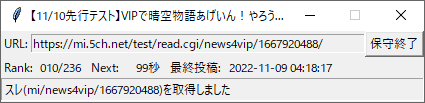

# viposhu

VIPのスレを保守する為の簡易パッケージ



## 保守間隔 (デフォルト値)

1. スレ内または自身による最終投稿から5分以降に、90秒間隔でチェックする。
2. 最初にsubject.txtを取得し、スレの位置が総スレ数の8割以下まで落ちていれば保守投稿する。
3. スレの位置が高くても、末尾"/l1"でスレを取得し最終投稿日時を確認し、45分以上経ってれば保守投稿する。
4. 1000到達等でスレストされていれば例外を発生し、スレのチェックを停止する。
5. 1に戻る。

## 投稿メッセージ

[hoshu5ch.json](hoshu5ch.json)内で設定した重み付けリストから、重みに応じてランダム([random.choices](https://docs.python.org/ja/3.10/library/random.html#random.choices))で投稿する。

## 実行

```bash
poetry run python -m viposhu
```
